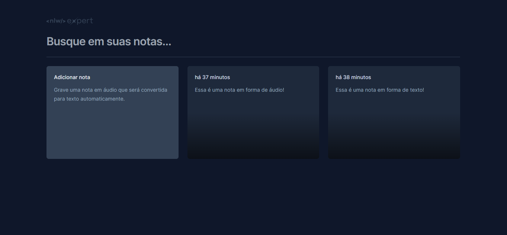

# NLW Expert | Rocketseat

## NLW Expert Notes

#### Notes

<div style="display: inline_block">


## Índice

- [Título e Imagem de capa](#nlw-expert-notes)
- [Descrição do projeto](#-descrição-do-projeto)
- [Tecnologias Utilizadas](#-tecnologias-utilizadas)
- [Executando](#-executando)
- [Deploy](#-deploy)
- [Desenvolvido](#-desenvolvido-por)
- [Licença](#%EF%B8%8F-licença)

</div>

## 📄 Descrição do Projeto

Essa aplicação foi desenvolvida durante o NLW Experts da Rocketseat utilizando React, TypeScript, Tailwind e a SpeechRecognition API.

- Aula 01
    - Descrição: Montagem do setup do projeto utilizando Vite e Tailwind. Colocando a mão na massa, dando início à interface de forma estática e conhecemos um dos primeiros pilares do React: componentização.
    
- Aula 02
    - Descrição: Entendendo mais sobre propriedades e estado, além de conhecer e usar as bibliotecas Radix UI (para uso de modal), date-fns (para tratamento de datas) e Sonner (para exibição de toasts).
    
- Aula 03
    - Descrição: Conhecendo o SpeechRecognition, API que vai transformar o áudio do usuário em notas. Além disso, vamos implementar o conceito de Lifting State Up para o gerenciamento de notas e a persistência dos dados utilizando LocalStorage.
    

## 🛠 Tecnologias Utilizadas

<div align="center">
    
    
    
    
    
    
    
    
    
    
</div>

## 👩‍💻 Executando 

Após clonar o repositório, acesse a pasta do projeto e execute os comandos abaixo:

```sh
npm install 
npm run dev
```

Acesse http://localhost:5173 para visualizar a aplicação.

## 🚀 Deploy
 
Usei a própria ferramenta de deploy do GitHub, <a href= "" target="_blank"> Clique Aqui </a> para ver o projeto.

## 🚧 Desenvolvido Por 
`Misla Wislaine` 

## 🗂️ Licença

Este projeto está sob a licença [MIT](LICENSE).